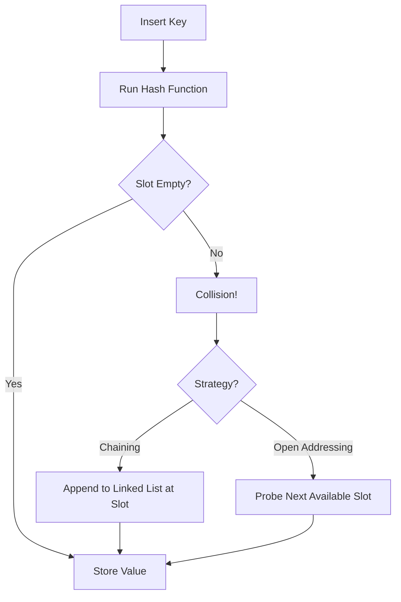

# Hash Tables: Collision Resolution Strategies

A **hash table** maps keys to values using a hash function. The function converts a key into an index, and the value gets stored there.
The problem? Two different keys can produce the **same index**. That's a collision.

---

## Why Collisions Happen
- Hash functions compress a large key space into a small array
- The output range is limited (e.g. 0–99 for an array of size 100)
- By the **pigeonhole principle**, collisions are mathematically inevitable

---

## Two Ways to Handle Them

### 1. Chaining
Each bucket holds a **linked list**. Colliding entries are appended to the list at that index.

- Simple to implement
- Performance degrades if many keys land in the same bucket

### 2. Open Addressing
When a collision occurs, **probe** for the next available slot in the array.

- Better cache performance (everything stays in the array)
- Gets slow as the array fills up

---

## The Load Factor

```
Load Factor = Number of entries / Array size
```

A higher load factor → more collisions. Most implementations **resize** the array when the load factor crosses ~0.7.

---

## Quick Comparison

| | Chaining | Open Addressing |
|---|---|---|
| Storage | External lists | In-array |
| Cache friendly | ✗ | ✓ |
| Handles high load | Better | Worse |

---

## How It Flows



---

*Hash tables average O(1) lookups — but only when collisions are kept in check.*
