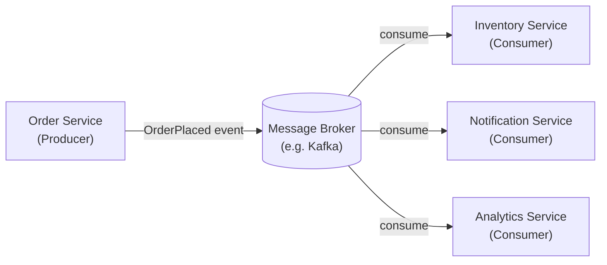

# Event-Driven Architecture

In a traditional **request-driven** system, Service A calls Service B directly and waits for a response. This creates **tight coupling** — if Service B is slow, Service A slows down too. **Event-Driven Architecture (EDA)** breaks this dependency.

Instead of calling each other directly, services communicate by **publishing** and **consuming events** through a central message broker (e.g., Kafka, RabbitMQ).

---

### 🔑 Core Concepts

* **Event:** An immutable record of something that *happened* (e.g., `OrderPlaced`, `PaymentProcessed`).
* **Producer:** A service that publishes an event to the broker and then forgets about it.
* **Consumer:** A service that subscribes to an event type and reacts when one arrives.
* **Message Broker:** The middleman that stores and routes events (e.g., Apache Kafka, RabbitMQ, AWS SNS/SQS).

---

### ⚙️ How It Works

1. **Order Service** processes a new order and publishes an `OrderPlaced` event to the broker.
2. The broker durably stores the event.
3. **Inventory Service** and **Notification Service** are both subscribed to `OrderPlaced`. Each consumes the event independently and does its own work.
4. The Order Service never knew — or cared — who was listening.

---

### 📊 Request-Driven vs. Event-Driven

| Feature | Request-Driven (REST/gRPC) | Event-Driven |
| :--- | :--- | :--- |
| **Coupling** | Tight (caller knows callee) | Loose (producer doesn't know consumers) |
| **Communication** | Synchronous | Asynchronous |
| **Availability** | Producer needs consumer up | Consumer can be offline; events wait |
| **Scalability** | Harder to fan-out | Easy to add new consumers |
| **Complexity** | Simple to reason about | Harder to trace end-to-end flows |

---

### 💡 Why It Matters

* **Decoupling:** Adding a new downstream feature (e.g., a new "Loyalty Points Service") means zero changes to any existing service — just subscribe to the right event.
* **Resilience:** A consumer crash doesn't affect the producer. Events accumulate in the broker and are processed once the consumer recovers.
* **Scalability:** Multiple consumer instances can read from the same topic in parallel, scaling throughput horizontally.

### ⚠️ The Trade-offs
* **Eventual Consistency:** Because steps happen asynchronously, the system is not immediately consistent. You must design for this.
* **Observability:** A single user action can trigger a cascade of events across many services, making end-to-end tracing harder. Tools like distributed tracing (e.g., Jaeger) are essential.
* **Message Ordering:** Guaranteeing that events are processed in the exact order they were produced adds significant complexity.
