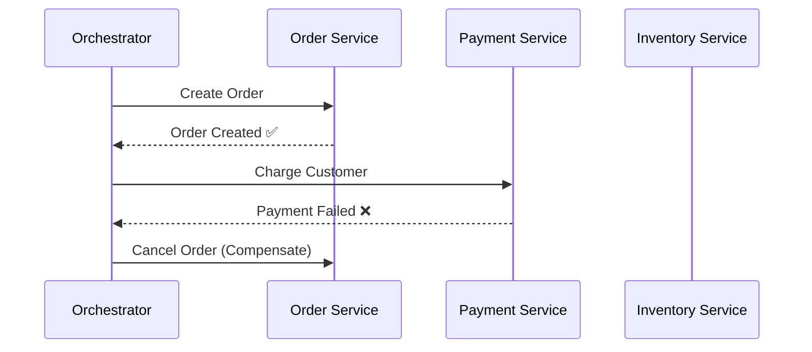

# The Saga Pattern

In a microservices architecture, a single business operation (e.g., placing an order) often spans multiple services. Because each service has its own database, you can't use a traditional ACID database transaction across them. The **Saga Pattern** solves this by breaking the operation into a sequence of local transactions, each publishing an event or message that triggers the next step.

---

### 🔄 How It Works

A saga is a sequence of steps. Each step:
1. Executes a **local transaction** that updates its own service's database.
2. Publishes an **event/message** to trigger the next step.

If any step fails, the saga runs **compensating transactions** to undo the work done by the preceding steps.

---

### 🗂️ Two Implementation Styles

#### **1. Choreography**
Each service listens for events and decides what to do next — there is no central coordinator.

* ✅ Simple, fully decoupled.
* ❌ Hard to track the overall flow; "event spaghetti" can develop.
* *Best for:* Simple workflows with few services.

#### **2. Orchestration**
A dedicated **Saga Orchestrator** service tells each participant what to do and listens for replies.

* ✅ Clear, single place to see the business flow.
* ❌ Introduces a central component that can become a bottleneck.
* *Best for:* Complex workflows with many steps or conditional logic.

---

### ↩️ Compensating Transactions

Because sagas use **eventual consistency** rather than ACID atomicity, each step must have a corresponding *compensating transaction* that can semantically undo it.

| Step | Action | Compensation |
|------|--------|--------------|
| 1 | Create Order (`PENDING`) | Cancel Order |
| 2 | Reserve Inventory | Release Inventory |
| 3 | Charge Payment | Issue Refund |
| 4 | Mark Order (`CONFIRMED`) | Mark Order (`FAILED`) |

> ⚠️ Compensations are not simple rollbacks — they are new forward-moving transactions that reverse the effect.

---

### 🆚 Saga vs. Two-Phase Commit (2PC)

| | **Saga** | **2PC** |
|---|---|---|
| Consistency | Eventual | Strong (ACID) |
| Availability | High | Low (blocking locks) |
| Complexity | Compensating logic | Distributed lock management |
| Scalability | Scales well | Does not scale across services |

In modern distributed systems, **2PC is largely avoided** because it holds locks across services, killing throughput. Sagas trade strong consistency for availability and scale.

---

### 🛠️ Real-World Use Cases

* **E-commerce checkout:** Reserve stock → charge card → confirm shipment.
* **Hotel booking platform:** Book room → charge card → send confirmation email.
* **Bank transfers:** Debit source account → credit destination account → notify both parties.

---

> **Key Takeaway** — The Saga Pattern replaces a single distributed ACID transaction with a chain of local transactions and compensating actions. It is the standard way to maintain data consistency across microservices without sacrificing availability or scalability.

---

### References

- [Chris Richardson — Saga Pattern](https://microservices.io/patterns/data/saga.html)
- [Microsoft — Saga Distributed Transactions Pattern](https://learn.microsoft.com/en-us/azure/architecture/reference-architectures/saga/saga)
